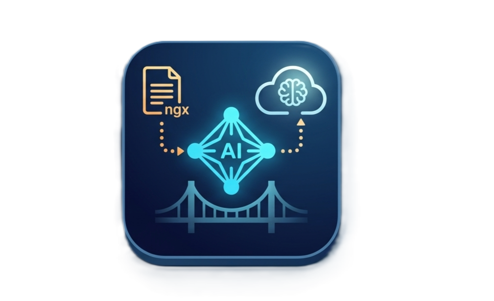

📑 AI Document Bridge for Paperless-ngx
AI Document Bridge is a lightweight FastAPI-based middleware that connects your Paperless-ngx instance to powerful AI models. It automatically analyzes your uploaded documents to extract Vendors, Dates, and Amounts, then updates your Paperless metadata and tags instantly.

🚀 Features
Dual-AI Support: Uses local AI (via Ollama) or falls back to Groq Cloud for high-speed processing.

Automatic Tagging: Maps document types (Receipt/Invoice) to your existing Paperless tags.

Dashboard: A simple web UI to monitor activity and manually trigger analysis for older documents.

Umbrel Ready: Designed to run as a native app on the Umbrel home server ecosystem.

🔑 Setup: Connecting to Paperless-ngx
To allow the Bridge to "talk" to your documents, you must generate an API Token. Follow these steps:

1. Generate your API Token
Log in to your Paperless-ngx dashboard.

Click on your Username in the top right corner and select Settings.

On the left sidebar, scroll down to the System section and click API Tokens.

Click + Add Token.

Give it a name (e.g., AI-Bridge) and ensure your user has Change permissions for Documents.

Copy the Token immediately. You will not be able to see it again.

2. Find your Tag IDs
The Bridge needs to know which specific Tag ID corresponds to a "Receipt" or "Invoice" in your system.

Go to the Tags menu in Paperless-ngx.

Click on the tag you want to use (e.g., "Receipts").

Look at the URL in your browser. It will look like this:

http://10.0.0.227:2349/tags/24/

The number 24 is your Tag ID. Record this for the Bridge settings.

🛠️ Configuration
Once the Bridge is running, navigate to http://<your-ip>:8000/settings and fill in the following:

Field	Description
Paperless Instance	The IP or hostname of your Paperless server (e.g., 10.0.0.227).
API Token	The token you generated in Step 1.
Tag Mapping	A JSON object: {"Receipt": 24, "Invoice": 25}.
Groq API Key	(Optional) Your API key from Groq Console.
🐳 Running with Docker
Bash
docker pull p1unknown/ai-bridge:latest
docker run -d \
  -p 8000:8000 \
  -v ./data:/app/data \
  --name ai-bridge \
  p1unknown/ai-bridge:latest
🤖 How it Works
Trigger: Paperless-ngx sends a webhook to the Bridge when a document is consumed.

Vision: The Bridge pulls the document thumbnail and sends it to Llama 3.2-vision.

Extraction: The AI identifies the vendor, total amount, and document date.

Update: The Bridge sends a PATCH request back to Paperless to rename the file and apply the correct tag.

📄 License
MIT © p1unknown

🔍 Troubleshooting
If your logs show SUCCESS but nothing changes in Paperless-ngx, check these common issues:

1. The "400 Bad Request" (Invalid Tag ID)
Symptoms: The terminal logs a 400 error or says SUCCESS but the document tag remains empty.

The Fix: Ensure the Tag ID in your tag_map JSON exists in Paperless.

Incorrect: "tag_map": {"Receipt": "Receipts"} (Text names don't work).

Correct: "tag_map": {"Receipt": 12} (Must be the integer ID).

2. The "403 Forbidden" (Token Permissions)
Symptoms: The bridge can see the list of documents but cannot update them.

The Fix: When creating your API Token, ensure the user associated with the token has "Change" permissions for the Documents model. If you are using a "Service User," it needs full access to the Documents app.

3. Trailing Slashes in URLs
Symptoms: Connection errors or 404 Not Found.

The Fix: In the settings, ensure your Paperless Instance address does not end with a /.

Correct: 10.0.0.227 or http://10.0.0.227:2349

Avoid: http://10.0.0.227:2349/

4. Port Conflicts
Symptoms: The Bridge fails to start with Address already in use.

The Fix: If you have another app running on port 8000, change the port in your docker run command: -p 8080:8000. You would then access the dashboard at http://localhost:8080.